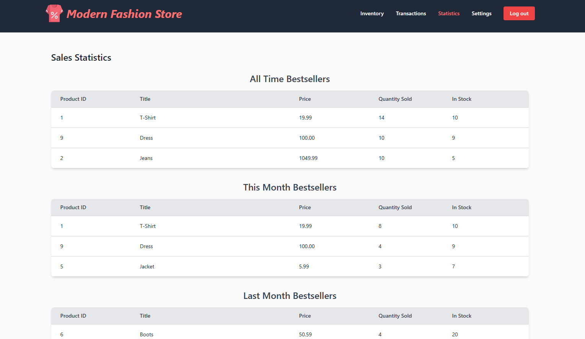

# Clothing Store

Author: **Ákos Kappel**

Live Demo: **[Modern Fashion Store](https://130.61.106.56/users/log_in)**

# Table of Contents

- [Running the app](#running-the-app)
- [Screenshots](#screenshots)
  - [Login Page](#login-page)
  - [Home](#home)
  - [Product Detail](#product-detail)
  - [Product Form](#product-form)
  - [Inventory with Filters](#inventory-with-filters)
  - [Transactions with Month Filter](#transactions-with-month-filter)
  - [Bestsellers](#bestsellers)
- [Task 1](#task-1-required)
- [Task 2](#task-2-required)
- [Task 3](#task-3-optional)
- [Task 4](#task-4-optional)
- [Task 5](#task-5-optional)
- [Task 6](#task-6-optional)
- [Bonus](#bonus)

## Running the app

To start your Phoenix server:

- Run `mix setup` to install and setup dependencies
- Apply database migrations with `mix ecto.migrate`
- Seed the database with `mix run priv/repo/seeds.exs`
- Start Phoenix endpoint with `mix phx.server` or inside IEx with `iex -S mix phx.server`

Now you can visit [`localhost:4000`](http://localhost:4000) from your browser.

## Screenshots

### Login Page

### Home

### Product Detail

### Product Form

### Inventory with Filters

### Transactions with Month Filter

### Bestsellers

## Task 1 (required)

Create a simple dashboard interface for a manager of a clothing company. This dashboard should display all products that are available for sale, manager should be able to add, edit and delete the items.

Specifications:

- Use Phoenix framework and Tailwind (Flowbite)
- Use PostgresDB
- Generate seeds for at least 10 products
- Each product should have at least these mandatory fields:
  - Photo
  - Title
  - Description
  - Category
  - Price
  - Stock
- User must be able to:
  - add / edit / delete a product
- Implement a filter over the products

### Solution

I installed Elixir with Phoenix framework and setup PostgreSQL.
In the [`priv/repo/seeds.exs`](priv/repo/seeds.exs) I generated 10 products whose images I took randomly from the internet and the prices are made up.
The structure of the products is defined in the migration file (it has all the required fields).
CRUD operations are defined in the [`lib/clothing_store_web/controllers/product_controller.ex`](lib/clothing_store_web/controllers/product_controller.ex) file and the corresponding SQL ORM queries are defined in the [`lib/clothing_store/products.ex`](lib/clothing_store/products.ex) file.
The admin has the option to view, add, edit and delete the products.
For the user interface I used Tailwind to customize the design, and I made sure to make most of the components responsive.
Finally, I implemented the filter over the products.
The user has the option to filter by category, minimum or maximum price, and by availability of the product.

## Task 2 (required)

Create dashboard with statistics/inventory/transactions over the products.

Specifications:

- Use Phoenix framework and Tailwind (Flowbite)
- Use PostgresDB
  - Generate seeds for at least 10 transactions
- Dashboard should visualize:
  - How many products are in stock
  - Best selling product
  - Number of transactions for the whole month (with filter for months)

### Solution

This task is continuing in the development of the first task.
First, I created 3 pages for the dashboard: `Inventory`, `Transactions` and `Statistics`.
The `Inventory` page shows the list of products from the first task (stock count is shown in a column for each product).
On the `Transactions` page, the user can see all the transactions.
A transaction can have multiple products.
This is achieved by a many-to-many relationship between the `transactions` and `products` tables.
The migration files define these relationships and create a pivoted table `products_transactions`.
Then, I modified the seeder to generate 10 random transactions.
The `Transactions` page also allows the user to filter the transactions by month.
There is a datepicker to select a specific month in a calendar, and a filter button to apply this filter.
Finally, the `Statistics` page shows the top 3 best selling products of all time, the current and the previous month.
Bestsellers are calculated by summing the number of times a product has been sold.

## Task 3 (optional)

User login screen

### Solution

For the login functionality I used the `mix phx.gen.auth` library.
This auto-generated all the necessary files for the user authentication, as well as the registration and login forms.
The library also provides a settings page for the user to change their email or password.
I customized the generated forms and disabled registration for new users, because the seeder automatically creates the admin, and new users are not allowed to register.
For demonstration purposes, the login form is automatically filled with the admin credentials, because all the dashboard routes are protected.

## Task 4 (optional)

LiveFeed for multiple users - Using the PubSub module

### Solution

To implement this, I used the `Phoenix.PubSub` module.
I created a channel called `products` in the [`lib/clothing_store_web/live/product_live/index.ex`](lib/clothing_store_web/live/product_live/index.ex) file.
The channel is used to broadcast events, such as when a product is added, modified, or deleted.
When an event is broadcasted, all the connected clients are notified, and their homepage with the products is updated accordingly, without having to reload the page.

## Task 5 (optional)

Using tags as categories (multiple tags per item)

### Solution

To implement this, I needed to create a new migration, that modifies the `products` table, and adds a new field called `tags`, which is a JSON array of strings.
Following this, I accordingly modified the products seeder and updated the dashboard interface as well as the CRUD operations, to work with the new field.

## Task 6 (optional)

Implementation of the filter over multiple tags

### Solution

For this task, I used the new `tags` field that I added in the previous task.
I added checkboxes for each tag in the filter form, and the user can now select any number of tags.
The results are then filtered, so that only products that contain at least one of the selected tags are shown.
Also, any of the filters can be combined together, for example, you can select a tag and a min price filter, and the products will be filtered by these conditions.

## Bonus

After finishing the project, I deployed it my own server, where I configured Nginx to serve the app.
You can find the link to the app [here](https://130.61.106.56/users/log_in).
